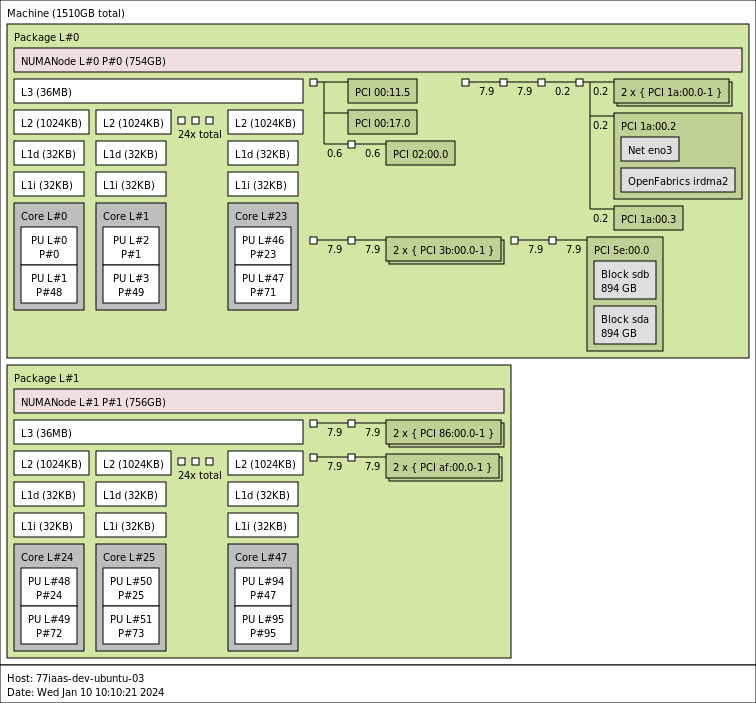

# Привязка виртуальных машин к конкретным CPU

Для обеспечения хорошей производительности виртуальных машин имеет смысл подумать
о запуске их с эксклюзивной привязкой к конкретным CPU хостовой машины.

Для начала имеет смысл посмотреть на топологию хостовой машины.

## Тестовая машина

```sh
lscpu
Architecture:            x86_64
  CPU op-mode(s):        32-bit, 64-bit
  Address sizes:         46 bits physical, 48 bits virtual
  Byte Order:            Little Endian
CPU(s):                  96
  On-line CPU(s) list:   0-95
Vendor ID:               GenuineIntel
  Model name:            Intel(R) Xeon(R) Gold 6248R CPU @ 3.00GHz
    CPU family:          6
    Model:               85
    Thread(s) per core:  2
    Core(s) per socket:  24
    Socket(s):           2
    Stepping:            7
    CPU max MHz:         4000.0000
    CPU min MHz:         1200.0000
    BogoMIPS:            6000.00
    Flags:               fpu vme de pse tsc msr pae mce cx8 apic sep mtrr pge mca cmov pat pse36 clflush dts acpi mmx fxsr sse sse2 ss ht tm pbe sysca
                         ll nx pdpe1gb rdtscp lm constant_tsc art arch_perfmon pebs bts rep_good nopl xtopology nonstop_tsc cpuid aperfmperf pni pclmu
                         lqdq dtes64 ds_cpl vmx smx est tm2 ssse3 sdbg fma cx16 xtpr pdcm pcid dca sse4_1 sse4_2 x2apic movbe popcnt tsc_deadline_time
                         r aes xsave avx f16c rdrand lahf_lm abm 3dnowprefetch cpuid_fault epb cat_l3 cdp_l3 invpcid_single ssbd mba ibrs ibpb stibp i
                         brs_enhanced tpr_shadow vnmi flexpriority ept vpid ept_ad fsgsbase tsc_adjust bmi1 avx2 smep bmi2 erms invpcid cqm mpx rdt_a
                         avx512f avx512dq rdseed adx smap clflushopt clwb intel_pt avx512cd avx512bw avx512vl xsaveopt xsavec xgetbv1 xsaves cqm_llc c
                         qm_occup_llc cqm_mbm_total cqm_mbm_local dtherm ida arat pln pts pku ospke avx512_vnni md_clear flush_l1d arch_capabilities
Virtualization features:
  Virtualization:        VT-x
Caches (sum of all):
  L1d:                   1.5 MiB (48 instances)
  L1i:                   1.5 MiB (48 instances)
  L2:                    48 MiB (48 instances)
  L3:                    71.5 MiB (2 instances)
NUMA:
  NUMA node(s):          2
  NUMA node0 CPU(s):     0-23,48-71
  NUMA node1 CPU(s):     24-47,72-95
Vulnerabilities:
  Gather data sampling:  Mitigation; Microcode
  Itlb multihit:         KVM: Mitigation: Split huge pages
  L1tf:                  Not affected
  Mds:                   Not affected
  Meltdown:              Not affected
  Mmio stale data:       Mitigation; Clear CPU buffers; SMT vulnerable
  Retbleed:              Mitigation; Enhanced IBRS
  Spec rstack overflow:  Not affected
  Spec store bypass:     Mitigation; Speculative Store Bypass disabled via prctl and seccomp
  Spectre v1:            Mitigation; usercopy/swapgs barriers and __user pointer sanitization
  Spectre v2:            Mitigation; Enhanced IBRS, IBPB conditional, RSB filling, PBRSB-eIBRS SW sequence
  Srbds:                 Not affected
  Tsx async abort:       Mitigation; TSX disabled
```

Так же можно посмотреть топологию

```sh
lstopo --of png > host.png
```



Здесь мы видим, что на нашей машине 2 [NUMA](https://docs.kernel.org/mm/numa.html)
ноды. И это надо учитывать при планировании qemu процессов (тредов).

Очень желательно, чтобы процессы qemu работали на одной NUMA ноде и там же была бы аллоцирована под них память.

## Ресурсы под систему

Так же имеет смысл прочие процессы хостовой системы не использовали CPU,
предназначенные для виртуальных машин.

На нашей тестовой машине выделим под них 0,48,24,72 CPU. Стоит обратить внимание,
это 2 ядра с учетом [гипер-трединга](https://en.wikipedia.org/wiki/Hyper-threading).
Пара 0 и 48 - это одно ядро с 2 тредами. У пары 24 и 72 такая же история.

### Привязка системных ресурсов к конкретным CPU

Все процессы запускаются в рамках systemd [слайсах](https://www.freedesktop.org/software/systemd/man/latest/systemd.slice.html).

> A slice unit is a concept for hierarchically managing resources of a group of processes.

Фактически слайсы определяют иерархию [cgroups](https://www.kernel.org/doc/html/latest/admin-guide/cgroup-v2.html)
на машине.

Посмотрим, какая иерархия слайсов.
```sh
systemd-cgls
-.slice
├─user.slice
│ └─user-1000.slice
│   ├─user@1000.service …
│   │ └─init.scope
│   │   ├─2754 /lib/systemd/systemd --user
│   │   └─2755 (sd-pam)
│   └─session-479.scope
│     ├─52512 sshd: ubuntu [priv]
│     ├─52571 sshd: ubuntu@pts/0
│     ├─52572 -bash
│     ├─52581 sudo -i
│     ├─52582 sudo -i
│     ├─52583 -bash
│     ├─52597 systemd-cgls
│     └─52598 tee
├─init.scope
│ └─1 /sbin/init
└─system.slice
  ├─irqbalance.service
  │ └─1903 /usr/sbin/irqbalance --foreground
  ├─packagekit.service
  │ └─50259 /usr/libexec/packagekitd
  ├─systemd-networkd.service
  │ └─1867 /lib/systemd/systemd-networkd
  ├─systemd-udevd.service
  │ └─1458 /lib/systemd/systemd-udevd
  ├─cron.service
  │ └─1897 /usr/sbin/cron -f -P
  ├─system-serial\x2dgetty.slice
  │ └─serial-getty@ttyS0.service
  │   └─2018 /sbin/agetty -o -p -- \u --keep-baud 115200,57600,38400,9600 ttyS0…
  ├─polkit.service
  │ └─1906 /usr/libexec/polkitd --no-debug
  ├─networkd-dispatcher.service
  │ └─1904 /usr/bin/python3 /usr/bin/networkd-dispatcher --run-startup-triggers
  ├─multipathd.service
  │ └─1462 /sbin/multipathd -d -s
  ├─ModemManager.service
  │ └─1969 /usr/sbin/ModemManager
  ├─systemd-journald.service
  │ └─1416 /lib/systemd/systemd-journald
  ├─unattended-upgrades.service
  │ └─1994 /usr/bin/python3 /usr/share/unattended-upgrades/unattended-upgrade-s…
  ├─ssh.service
  │ └─43450 sshd: /usr/sbin/sshd -D [listener] 0 of 10-100 startups
  ├─snapd.service
  │ └─42616 /usr/lib/snapd/snapd
  ├─rsyslog.service
  │ └─3601 /usr/sbin/rsyslogd -n -iNONE
  ├─upower.service
  │ └─12675 /usr/libexec/upowerd
  ├─systemd-resolved.service
  │ └─1869 /lib/systemd/systemd-resolved
  ├─udisks2.service
  │ └─1922 /usr/libexec/udisks2/udisksd
  ├─dbus.service
  │ └─1898 @dbus-daemon --system --address=systemd: --nofork --nopidfile --syst…
  ├─systemd-timesyncd.service
  │ └─1827 /lib/systemd/systemd-timesyncd
  ├─system-getty.slice
  │ └─getty@tty1.service
  │   └─2020 /sbin/agetty -o -p -- \u --noclear tty1 linux
  └─systemd-logind.service
    └─1914 /lib/systemd/systemd-logind
```

И эта картинка соответствует иерархии cgroups

```sh
tree -d /sys/fs/cgroup/
/sys/fs/cgroup/
├── dev-hugepages.mount
├── dev-mqueue.mount
├── init.scope
├── proc-sys-fs-binfmt_misc.mount
├── sys-fs-fuse-connections.mount
├── sys-kernel-config.mount
├── sys-kernel-debug.mount
├── sys-kernel-tracing.mount
├── system.slice
│   ├── ModemManager.service
│   ├── boot-efi.mount
│   ├── cron.service
│   ├── dbus.service
│   ├── frr.service
│   ├── irqbalance.service
│   ├── multipathd.service
│   ├── networkd-dispatcher.service
│   ├── packagekit.service
│   ├── polkit.service
│   ├── rsyslog.service
│   ├── run-qemu.mount
│   ├── snap-core20-1974.mount
│   ├── snap-core20-2105.mount
│   ├── snap-lxd-24322.mount
│   ├── snap-snapd-20290.mount
│   ├── snap-snapd-20671.mount
│   ├── snapd.service
│   ├── snapd.socket
│   ├── ssh.service
│   ├── swap.img.swap
│   ├── system-getty.slice
│   │   └── getty@tty1.service
│   ├── system-modprobe.slice
│   ├── system-serial\x2dgetty.slice
│   │   └── serial-getty@ttyS0.service
│   ├── system-systemd\x2dfsck.slice
│   ├── systemd-journald.service
│   ├── systemd-logind.service
│   ├── systemd-networkd.service
│   ├── systemd-resolved.service
│   ├── systemd-timesyncd.service
│   ├── systemd-udevd.service
│   ├── udisks2.service
│   ├── unattended-upgrades.service
│   ├── upower.service
│   └── vpp.service
└── user.slice
    └── user-1000.slice
        ├── session-128.scope
        ├── session-479.scope
        ├── session-7.scope
        └── user@1000.service
            ├── app.slice
            │   └── dbus.socket
            └── init.scope
```

Корневой слайс `-.slice` модифицировать мы не будем. В нем никаких ограничений нет.
А вот в `system.slice` и `user.slice` мы ограничим набор CPU.

```sh
mkdir /etc/systemd/system/system.slice.d/
echo "[Slice]
AllowedCPUs=0,48,24,72" > /etc/systemd/system/system.slice.d/10-CPUSet.conf

mkdir /etc/systemd/system/user.slice.d/
echo "[Slice]
AllowedCPUs=0,48,24,72" > /etc/systemd/system/user.slice.d/10-CPUSet.conf

systemctl daemon-reload
```

Проверим, что наши настройки применились

```sh
systemctl cat system.slice
# /etc/systemd/system/system.slice.d/10-CPUSet.conf
[Slice]
AllowedCPUs=0,48,24,72

systemctl cat user.slice
# /lib/systemd/system/user.slice
#  SPDX-License-Identifier: LGPL-2.1-or-later
#
#  This file is part of systemd.
#
#  systemd is free software; you can redistribute it and/or modify it
#  under the terms of the GNU Lesser General Public License as published by
#  the Free Software Foundation; either version 2.1 of the License, or
#  (at your option) any later version.

[Unit]
Description=User and Session Slice
Documentation=man:systemd.special(7)
Before=slices.target

# /etc/systemd/system/user.slice.d/10-CPUSet.conf
[Slice]
AllowedCPUs=0,48,24,72
```

Проверим настройки cgroups

```sh
cat /sys/fs/cgroup/system.slice/cpuset.cpus
0,24,48,72
cat /sys/fs/cgroup/user.slice/cpuset.cpus
0,24,48,72
```

## Ресурсы для виртуальных машин

Пользовательским машинам мы будем предоставлять столько CPU, сколько виртуальных CPU
конфигурируется на машине.

**Внимание.** На самом деле qemu создаст больше тредов, чем количество vCPU, однако
будем игнорировать этот факт и позволим ОС планировать все треды одной виртуальной
машины на ограниченном наборе физических CPU.
Так мы можем создать виртаульную машину с 4 vCPU, привяжем её к 4 физическим CPU,
при этом qemu может создать 6 тредов.

### Аллокация памяти на нужной NUMA ноде

Qemu позволяет указать на какой NUMA ноде аллоцировать память.

В случае, если используются hugetbl, то надо описать memory-backend так

```conf
-object memory-backend-file,id=mem,size=1Gb,mem-path=/dev/hugepages,share=on,host-nodes=0,policy=bind \
-numa node,memdev=mem \
-mem-prealloc
```

В случае, когда hugetbl не испольуются

```conf
-object memory-backend-ram,size=1Gb,id=mem,host-nodes=0,policy=bind,prealloc=on \
-numa node,memdev=mem
```

```doc
The host-nodes option binds the memory range to a list of NUMA host nodes.
The policy option sets the NUMA policy to one of the following values:
- default - default host policy
- preferred - prefer the given host node list for allocation
- bind - restrict memory allocation to the given host node list
- interleave - interleave memory allocations across the given host node list
```

#### Настройка hugetbl

Для того чтобы виртуальные машины могли использовать
[hugetbl](https://www.kernel.org/doc/html/latest/admin-guide/mm/hugetlbpage.html)
надо сконфигурировать ядро примерно так.

```sh
cat /etc/sysctl.d/80-qemu.conf
vm.nr_hugepages=10240
```

Здесь мы создаем 10240 страниц по 2Мб.

### Запуск виртуальной машины

В качестве гостевой ОС будем использовать [cirros](https://github.com/cirros-dev/cirros).

Скачиваем образ и делаем с него снапшоты

```sh
wget https://download.cirros-cloud.net/0.6.2/cirros-0.6.2-x86_64-disk.img -O cirros.img

qemu-img create -f qcow2 -b cirros.img -F qcow2 test-01.img 10G
qemu-img create -f qcow2 -b cirros.img -F qcow2 test-02.img 10G
```

Запускать виртуалку будем, используя systemd-run, что позволит нам указать отдельный
слайс и передать дополнительные настройки cgroup.

#### Без hugetbl

Запиним виртуальную машину в 0 NUMA ноде, на процессорах 3, 50, 4 и 51 (2 ядра и 4 треда)

```sh
sudo systemd-run --slice=qemu.slice --unit=vm-test-001 -p AllowedCPUs=3,50,4,51 \
    qemu-system-x86_64 \
        -name vm-test-001 \
        -machine accel=kvm:tcg \
        -smp cpus=4 \
        -m 1024m \
        -object memory-backend-ram,size=1024m,id=mem,host-nodes=0,policy=bind,prealloc=on \
        -numa node,memdev=mem \
        -drive file=$(pwd)/test-01.img,if=virtio \
        -netdev user,id=net0,ipv6=off,restrict=off,net=10.0.2.0/24,hostfwd=tcp:127.0.0.1:10022-:22 \
        -device e1000,netdev=net0 \
        -display none
```

#### С использованием hugetbl

Запиним виртуальную машину в 0 NUMA ноде, на процессорах 5, 52, 6 и 53 (2 ядра и 4 треда)

```sh
sudo systemd-run --slice=qemu.slice --unit=vm-test-002 -p AllowedCPUs=5,52,6,53 \
    qemu-system-x86_64 \
        -name vm-test-002 \
        -machine accel=kvm:tcg \
        -smp cpus=4 \
        -m 1024m \
        -object memory-backend-file,id=mem,size=1024m,mem-path=/dev/hugepages,share=on,host-nodes=0,policy=bind \
        -numa node,memdev=mem \
        -mem-prealloc \
        -drive file=$(pwd)/test-02.img,if=virtio \
        -netdev user,id=net0,ipv6=off,restrict=off,net=10.0.2.0/24,hostfwd=tcp:127.0.0.1:10023-:22 \
        -device e1000,netdev=net0 \
        -display none
```

Проверим, что виртуальные машины запустились

```sh
systemctl status vm-test-001.service
● vm-test-001.service - /usr/bin/qemu-system-x86_64 -machine accel=kvm:tcg -smp cpus=4 -m 1024M -object memory-backend-ram,size=1024M,id=mem,host-nod>
     Loaded: loaded (/run/systemd/transient/vm-test-001.service; transient)
  Transient: yes
     Active: active (running) since Thu 2024-01-11 07:54:51 UTC; 8s ago
   Main PID: 69254 (qemu-system-x86)
      Tasks: 18 (limit: 629145)
     Memory: 198.4M
        CPU: 3.033s
     CGroup: /qemu.slice/vm-test-001.service
             └─69254 /usr/bin/qemu-system-x86_64 -machine accel=kvm:tcg -smp cpus=4 -m 1024M -object memory-backend-ram,size=1024M,id=mem,host-nodes=>

Jan 11 07:54:51 77iaas-dev-ubuntu-03 systemd[1]: Started /usr/bin/qemu-system-x86_64 -machine accel=kvm:tcg -smp cpus=4 -m 1024M -object memory-backe

systemctl status vm-test-002.service
● vm-test-002.service - /usr/bin/qemu-system-x86_64 -name vm-test-002 -machine accel=kvm:tcg -smp cpus=4 -m 1024m -object memory-backend-file,id=mem,>
     Loaded: loaded (/run/systemd/transient/vm-test-002.service; transient)
  Transient: yes
     Active: active (running) since Thu 2024-01-11 11:01:10 UTC; 6s ago
   Main PID: 70150 (qemu-system-x86)
      Tasks: 19 (limit: 629145)
     Memory: 55.6M
        CPU: 3.118s
     CGroup: /qemu.slice/vm-test-002.service
             └─70150 /usr/bin/qemu-system-x86_64 -name vm-test-002 -machine accel=kvm:tcg -smp cpus=4 -m 1024m -object memory-backend-file,id=mem,siz>

Jan 11 11:01:10 77iaas-dev-ubuntu-02 systemd[1]: Started /usr/bin/qemu-system-x86_64 -name vm-test-002 -machine accel=kvm:tcg -smp cpus=4 -m 1024m
```

Логи qemu процесса можно посмотреть

```sh
journalctl -u vm-test-001.service
```

Проверим на каких CPU работает первая виртуальная машина

```sh
ps -eL -o psr,pid,spid,cmd | grep qemu-system-x86_64 | grep vm-test-001  | grep -v grep | sort
3   70099   70105 /usr/bin/qemu-system-x86_64 -name vm-test-001 -machine accel=kvm:tcg -smp cpus=4 -m 1024m -object memory-backend-ram,size=1024m,id=mem,host-nodes=0,policy=bind,prealloc=on -numa node,memdev=mem -drive file=/home/ubuntu/test-01.img,if=virtio -netdev user,id=net0,ipv6=off,restrict=off,net=10.0.2.0/24,hostfwd=tcp:127.0.0.1:10022-:22 -device e1000,netdev=net0 -display none
4   70099   70099 /usr/bin/qemu-system-x86_64 -name vm-test-001 -machine accel=kvm:tcg -smp cpus=4 -m 1024m -object memory-backend-ram,size=1024m,id=mem,host-nodes=0,policy=bind,prealloc=on -numa node,memdev=mem -drive file=/home/ubuntu/test-01.img,if=virtio -netdev user,id=net0,ipv6=off,restrict=off,net=10.0.2.0/24,hostfwd=tcp:127.0.0.1:10022-:22 -device e1000,netdev=net0 -display none
50   70099   70100 /usr/bin/qemu-system-x86_64 -name vm-test-001 -machine accel=kvm:tcg -smp cpus=4 -m 1024m -object memory-backend-ram,size=1024m,id=mem,host-nodes=0,policy=bind,prealloc=on -numa node,memdev=mem -drive file=/home/ubuntu/test-01.img,if=virtio -netdev user,id=net0,ipv6=off,restrict=off,net=10.0.2.0/24,hostfwd=tcp:127.0.0.1:10022-:22 -device e1000,netdev=net0 -display none
50   70099   70106 /usr/bin/qemu-system-x86_64 -name vm-test-001 -machine accel=kvm:tcg -smp cpus=4 -m 1024m -object memory-backend-ram,size=1024m,id=mem,host-nodes=0,policy=bind,prealloc=on -numa node,memdev=mem -drive file=/home/ubuntu/test-01.img,if=virtio -netdev user,id=net0,ipv6=off,restrict=off,net=10.0.2.0/24,hostfwd=tcp:127.0.0.1:10022-:22 -device e1000,netdev=net0 -display none
50   70099   70108 /usr/bin/qemu-system-x86_64 -name vm-test-001 -machine accel=kvm:tcg -smp cpus=4 -m 1024m -object memory-backend-ram,size=1024m,id=mem,host-nodes=0,policy=bind,prealloc=on -numa node,memdev=mem -drive file=/home/ubuntu/test-01.img,if=virtio -netdev user,id=net0,ipv6=off,restrict=off,net=10.0.2.0/24,hostfwd=tcp:127.0.0.1:10022-:22 -device e1000,netdev=net0 -display none
51   70099   70107 /usr/bin/qemu-system-x86_64 -name vm-test-001 -machine accel=kvm:tcg -smp cpus=4 -m 1024m -object memory-backend-ram,size=1024m,id=mem,host-nodes=0,policy=bind,prealloc=on -numa node,memdev=mem -drive file=/home/ubuntu/test-01.img,if=virtio -netdev user,id=net0,ipv6=off,restrict=off,net=10.0.2.0/24,hostfwd=tcp:127.0.0.1:10022-:22 -device e1000,netdev=net0 -display none
```

Всё как и ожидалось, используются 3, 4, 50 и 51.

На второй машине

```sh
ps -eL -o psr,pid,spid,cmd | grep qemu-system-x86_64 | grep vm-test-002  | grep -v grep | sort
5   70150   70161 /usr/bin/qemu-system-x86_64 -name vm-test-002 -machine accel=kvm:tcg -smp cpus=4 -m 1024m -object memory-backend-file,id=mem,size=1024m,mem-path=/dev/hugepages,share=on,host-nodes=0,policy=bind -numa node,memdev=mem -mem-prealloc -drive file=/home/ubuntu/test-02.img,if=virtio -netdev user,id=net0,ipv6=off,restrict=off,net=10.0.2.0/24,hostfwd=tcp:127.0.0.1:10023-:22 -device e1000,netdev=net0 -display none
6   70150   70150 /usr/bin/qemu-system-x86_64 -name vm-test-002 -machine accel=kvm:tcg -smp cpus=4 -m 1024m -object memory-backend-file,id=mem,size=1024m,mem-path=/dev/hugepages,share=on,host-nodes=0,policy=bind -numa node,memdev=mem -mem-prealloc -drive file=/home/ubuntu/test-02.img,if=virtio -netdev user,id=net0,ipv6=off,restrict=off,net=10.0.2.0/24,hostfwd=tcp:127.0.0.1:10023-:22 -device e1000,netdev=net0 -display none
6   70150   70151 /usr/bin/qemu-system-x86_64 -name vm-test-002 -machine accel=kvm:tcg -smp cpus=4 -m 1024m -object memory-backend-file,id=mem,size=1024m,mem-path=/dev/hugepages,share=on,host-nodes=0,policy=bind -numa node,memdev=mem -mem-prealloc -drive file=/home/ubuntu/test-02.img,if=virtio -netdev user,id=net0,ipv6=off,restrict=off,net=10.0.2.0/24,hostfwd=tcp:127.0.0.1:10023-:22 -device e1000,netdev=net0 -display none
52   70150   70159 /usr/bin/qemu-system-x86_64 -name vm-test-002 -machine accel=kvm:tcg -smp cpus=4 -m 1024m -object memory-backend-file,id=mem,size=1024m,mem-path=/dev/hugepages,share=on,host-nodes=0,policy=bind -numa node,memdev=mem -mem-prealloc -drive file=/home/ubuntu/test-02.img,if=virtio -netdev user,id=net0,ipv6=off,restrict=off,net=10.0.2.0/24,hostfwd=tcp:127.0.0.1:10023-:22 -device e1000,netdev=net0 -display none
52   70150   70162 /usr/bin/qemu-system-x86_64 -name vm-test-002 -machine accel=kvm:tcg -smp cpus=4 -m 1024m -object memory-backend-file,id=mem,size=1024m,mem-path=/dev/hugepages,share=on,host-nodes=0,policy=bind -numa node,memdev=mem -mem-prealloc -drive file=/home/ubuntu/test-02.img,if=virtio -netdev user,id=net0,ipv6=off,restrict=off,net=10.0.2.0/24,hostfwd=tcp:127.0.0.1:10023-:22 -device e1000,netdev=net0 -display none
53   70150   70160 /usr/bin/qemu-system-x86_64 -name vm-test-002 -machine accel=kvm:tcg -smp cpus=4 -m 1024m -object memory-backend-file,id=mem,size=1024m,mem-path=/dev/hugepages,share=on,host-nodes=0,policy=bind -numa node,memdev=mem -mem-prealloc -drive file=/home/ubuntu/test-02.img,if=virtio -netdev user,id=net0,ipv6=off,restrict=off,net=10.0.2.0/24,hostfwd=tcp:127.0.0.1:10023-:22 -device e1000,netdev=net0 -display none
```

Тоже все хорошо - 5, 6, 52 и 53.

Проверяем, что появился новый slice в иерархии cgroups

```sh
systemd-cgls
Control group /:
-.slice
├─qemu.slice
│ ├─vm-test-002.service
│ │ └─70150 /usr/bin/qemu-system-x86_64 -name vm-test-002 -machine accel=kvm:tcg -smp cpus=4 -m 1024m -object memory-backend-file,id=mem,size=1024m,m>
│ └─vm-test-001.service
│   └─70099 /usr/bin/qemu-system-x86_64 -name vm-test-001 -machine accel=kvm:tcg -smp cpus=4 -m 1024m -object memory-backend-ram,size=1024m,id=mem,ho

cat /sys/fs/cgroup/qemu.slice/vm-test-001.service/cpuset.cpus
3-4,50-51
cat /sys/fs/cgroup/qemu.slice/vm-test-002.service/cpuset.cpus
5-6,52-53
```

Посмотрим, где выделилась память для процессов

```sh
# один из тредов первой виртуалки
cat /proc/70107/numa_maps | grep bind
7fa3c7e00000 bind:0 anon=262144 dirty=262144 active=39847 N0=262144 kernelpagesize_kB=4

# один из тредов второй виртуалки
cat /proc/70159/numa_maps | grep bind
7fa277e00000 bind:0 file=/dev/hugepages/qemu_back_mem.mem.WQDRfi\040(deleted) huge dirty=512 N0=512 kernelpagesize_kB=2048
```

Параметр N0, говорит, что аллоцирована память на NUMA ноде 0.

А сейчас можно остановить виртуальные машины

```sh
systemctl stop vm-test-001.service
systemctl stop vm-test-002.service
```
